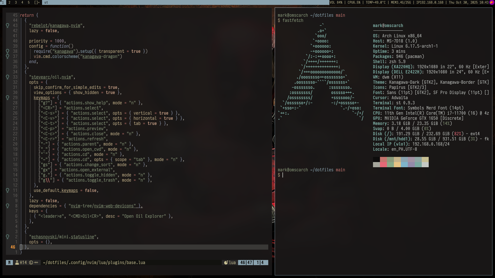

# 🏠 .dotfiles  

My personal **suckless setup** — minimal, fast, and built for Arch Linux.  
The color palette is based on the [Kanagawa Dragon](https://github.com/rebelot/kanagawa.nvim) theme.  
You're welcome to explore or reuse parts of it, but note that some settings are highly customized.

---

### 💻 Operating System
- **Arch Linux**

---

### ⚙️ Configurations
- picom – compositor for transparency and shadows  
- pipewire – modern audio server  
- zsh – shell setup with aliases and plugins  
- tmux – terminal multiplexer  
- sxhkd – hotkey daemon  
- fzf – fuzzy finder  
- nvim – Neovim configuration  
- zoxide – smarter `cd`  
- yazi – terminal file manager  
- eza – modern `ls` replacement  

---

### 🧱 Suckless Components
- [**dwm**](https://github.com/markchristianlacap/dwm)  
- [**st**](https://github.com/markchristianlacap/st)  
- [**dmenu**](https://github.com/markchristianlacap/dmenu)  
- [**dwmblocks-async**](https://github.com/markchristianlacap/dwmblocks-async)  

---

### ✨ Fonts
- **Iosevka SS04**  
- **Symbols Nerd Font**

---

### 📸 Preview

