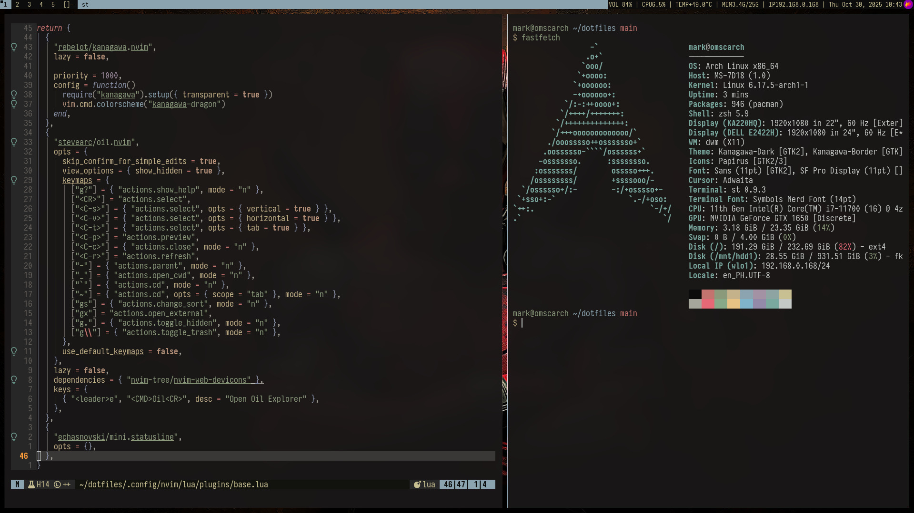

# 🏠 .dotfiles  

Personal dotfiles for Arch Linux (primary) and macOS (secondary).  
Color palette: [Kanagawa Dragon](https://github.com/rebelot/kanagawa.nvim)

---

## 🧱 Window Managers

**Linux:** [oxwm](https://github.com/markchristianlacap/oxwm) · [dwm](https://github.com/markchristianlacap/dwm) · [st](https://github.com/markchristianlacap/st) · [dmenu](https://github.com/markchristianlacap/dmenu) · [dwmblocks-async](https://github.com/markchristianlacap/dwmblocks-async)  
**macOS:** [Hammerspoon](.hammerspoon/README.md) (tiling WM via Lua)

---

## 🛠️ Tools

**Display:** picom · dunst · sxhkd · feh · flameshot  
**Shell:** zsh · kitty · tmux · zoxide · yazi · fzf · eza  
**Editor:** Neovim (LSP, lazy.nvim, cspell, stylua)  
**Audio:** pipewire · amixer · pavucontrol  

---

## 📂 Structure

```
.config/        # dunst, kitty, nvim, picom, pipewire, sxhkd, tmux
.hammerspoon/   # macOS tiling (see README.md inside)
.scripts/       # battery, bluetooth, powermenu, tmux-session, etc.
.xinitrc        # X session startup
.Xresources     # Terminal colors (Kanagawa Dragon)
.zprofile       # Auto-start X on tty1
.zshrc          # Shell config
```

---

## 🚀 Installation

```bash
# Using GNU Stow
stow .

# Manual
ln -sf ~/.dotfiles/.zshrc ~/.zshrc
ln -sf ~/.dotfiles/.config/* ~/.config/
chmod +x ~/.dotfiles/.scripts/*
```

**Fonts:** Iosevka SS04 · Nerd Fonts Symbols  
**Arch:** `yay -S ttf-iosevka ttf-nerd-fonts-symbols`

---

## 📸 Preview


